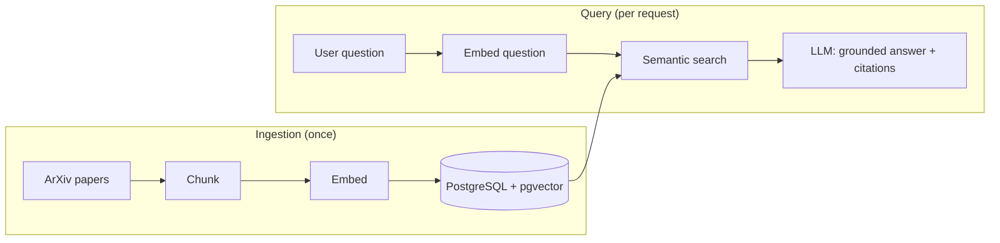

# PaperMind — RAG over AI Research Papers

> Ask a natural-language question about AI research and get a cited answer, drawn from a corpus of thousands of ArXiv papers. A lean, complete, deployed RAG system — built to be understood end to end.

**PaperMind is the RAG flagship of the portfolio.** It proves the full retrieval-augmented-generation stack — chunking, embeddings, semantic search, grounded generation, citations — in a system that's small enough to finish and deploy, and clean enough to explain in an interview.

---

## What it does

- **Ask, get cited answers** — questions about AI research answered from a real paper corpus, with sources shown.
- **Semantic search** — finds relevant passages by meaning, not just keywords.
- **Grounded generation** — answers are built from retrieved passages, reducing hallucination.
- **Honest refusal** — when the corpus doesn't support an answer, it says so.
- **Deployed** — a live, public URL anyone can try.

## Tech stack

| Category | Technology | Why |
|---|---|---|
| **Language** | Python 3.12 | — |
| **RAG framework** | LangChain | industry-standard RAG orchestration |
| **Embedding** | sentence-transformers (`all-MiniLM-L6-v2`) | fast, free, local |
| **Vector DB** | PostgreSQL + pgvector | vector search + SQL in one store |
| **LLM** | OpenAI (`gpt-4o-mini`) or local (Ollama) | cheap / free option |
| **Backend** | FastAPI | typed API |
| **Frontend** | Streamlit | fastest way to a usable UI |
| **Container** | Docker + docker-compose | app + Postgres together |
| **CI/CD** | GitHub Actions | test + build |
| **Deploy** | AWS (App Runner + RDS) | via Slipway blueprint |
| **Dev** | Pydantic v2, tenacity, pytest, ruff, uv | — |

## Architecture



## Product structure

```text
papermind/
├── app/
│   ├── main.py                   # FastAPI entrypoint
│   └── api/
│       ├── routes.py             # POST /ask, GET /health
│       └── schemas.py            # AskRequest, Answer, Citation
├── ui/
│   └── Home.py                   # Streamlit: question box → answer + sources
├── core/
│   ├── config.py                 # Models, top-k, thresholds, env
│   ├── llm.py                    # LLM wrapper — the only place a provider is named
│   └── types.py                  # Paper, Chunk, Passage, Answer, Citation
├── ingestion/
│   ├── fetch.py                  # ArXiv / HuggingFace dataset download
│   ├── clean.py                  # Text cleaning, dedup
│   ├── chunk.py                  # RecursiveCharacterTextSplitter
│   ├── embed.py                  # sentence-transformers batch embedding
│   └── index.py                  # Write chunks + vectors to pgvector
├── retrieval/
│   ├── retriever.py              # Question → embedding → top-k by cosine similarity
│   └── prompt.py                 # Grounding prompt: answer ONLY from context, else refuse
├── evaluation/
│   ├── questions.jsonl           # 10-20 hand-written questions with expected sources
│   └── run.py                    # hit-rate@k, latency, cost per query
├── storage/
│   ├── db.py                     # Postgres + pgvector connection
│   └── models.py                 # papers, chunks tables
├── infra/                        # Terraform — the Slipway blueprint, vendored here
├── tests/
│   ├── test_chunk.py             # Known text → expected chunk boundaries
│   ├── test_retrieval.py         # Known question → expected paper in top-k
│   └── test_refusal.py           # Out-of-corpus question → refusal, not a guess
├── .github/workflows/ci.yml
├── .env.example
├── docker-compose.yml            # App + Postgres/pgvector
├── Dockerfile
├── pyproject.toml
└── README.md
```

**Why this shape.** `ingestion/` and `retrieval/` are separate packages because they run at completely different times and rates — ingestion is a one-off bulk job, retrieval is per request. Keeping them apart is what stops the "two kinds of loading" confusion from leaking into the code. `evaluation/` exists from early on because an improvement without a number attached is a guess.

## Models used

| Role | Model | Notes |
|---|---|---|
| Embedding (corpus + query) | `all-MiniLM-L6-v2` | Local, free, fast. The same model must embed both sides |
| Answer generation | `gpt-4o-mini`-class, or Ollama locally | Cheap; the grounding prompt matters more than the model |
| Judge (optional, v2) | A stronger, **different** model | Only once you add evaluation depth |

**Corpus: ~5-10k ArXiv CS/AI abstracts** — HuggingFace `CShorten/ML-ArXiv-Papers`, or the Kaggle ArXiv dump filtered to `cs.*`. Public data only.

**Why ArXiv and not PubMed.** PubMed abstracts would put the whole portfolio in one domain, which is tidier. ArXiv wins anyway for one practical reason: while you are learning RAG you need to be able to tell whether an answer is *actually right*. Ask "what is attention?" against an AI-papers corpus and you can judge the answer yourself. Ask a pharmacology question against PubMed and you cannot — which means you cannot debug your own retrieval. Keep the corpus in a domain you can referee. (PubMed remains the alternative if you later want the domain unified; the pipeline does not change.)

## Skills demonstrated

The full RAG pipeline — chunking, embeddings, semantic retrieval, grounded generation, source citations — packaged as a containerized, cloud-deployed service with CI/CD.

## Productization notes

- **Embed the query with the same model as the corpus.** A mismatch produces silently bad retrieval with no error anywhere.
- **The grounding prompt is the whole anti-hallucination story.** "Answer only from the context below; if it does not contain the answer, say you don't know." Then test that it actually refuses.
- **Refusal is a feature, and it needs a test.** Ask something the corpus cannot answer and assert the system says so.
- **Citations must resolve.** Every cited source should map back to a real chunk in the DB — assert it, don't eyeball it.
- **Chunk size is a measured decision, not a default.** Try two or three and report hit-rate for each. That table is what turns "I built a RAG" into "I tuned a RAG".
- **Build the eval harness before tuning anything.** 10-20 hand-written questions with expected sources is enough to make every later change measurable.
- **Index the vector column.** pgvector without an index does a sequential scan; it is fine at 30k chunks and not fine later. Know which one you are using and why.
- **Cost per query is a number you should know.** Publish it. It is usually smaller than people expect, and knowing it signals cost awareness.
- **Cold starts on scale-to-zero compute.** The first request after idle is slow. Keep it warm during demo hours or show an honest "waking up" state.

## What to show on GitHub

- **Live link at the very top.** It is the whole point.
- **The hero image is an answer with its sources visible** — question, grounded answer, cited papers underneath.
- **Publish honest metrics**: retrieval accuracy on your hand-written questions, average latency, cost per query. Small numbers honestly reported beat vague claims.
- **Show a refusal.** A question the corpus cannot answer, and the system saying so.
- **Include the architecture diagram** and one paragraph on the ingestion-vs-query distinction — it is the thing most RAG READMEs never explain clearly.

## Status

⬜ Not started — the recommended **first** project. Small, complete, deployable in ~2 weeks.

> This replaces the heavier "Groundwork" spec. Once PaperMind ships, its evaluation and hybrid-search ideas can be layered on as a **v2** — on top of a system that already works.

### v2 ideas (only after v1 is live)

| Addition | What it buys you |
|---|---|
| **Hybrid search** — BM25 (or AWS OpenSearch) + dense, fused with reciprocal rank fusion | Keyword recall the dense model misses; and OpenSearch closes the "Elasticsearch" gap in your CV |
| **Cross-encoder reranking** (`ms-marco-MiniLM-L-6-v2`) | Precision at the top of the list, measurably |
| **Query rewriting / HyDE** | Better retrieval on badly-phrased questions |
| **Calibrated LLM judge** — faithfulness, context precision/recall, Cohen's κ, bootstrap CIs | A configuration-comparison table instead of an opinion |
| **CI eval gate** | The build goes red on a quality regression |
| **Airflow DAG for ingestion** (fetch → chunk → embed → index) | A natural, honest orchestration story without waiting for Cadence |
| **Multi-hop decomposition via LangGraph** | Sub-question → parallel retrieval → merge, and a second LangGraph surface besides Chart |
