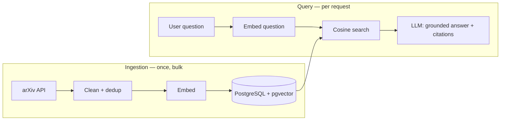

# PaperMind


**Ask a question about AI research, get an answer grounded in real papers — with the sources it came from.**

Retrieval-augmented generation over a corpus of arXiv CS/AI abstracts. Semantic search finds the
relevant papers, a language model answers from those papers only, and every claim carries its
citation. When the corpus cannot answer, it says so instead of guessing.

Runs entirely on your machine with `docker compose up`, on a local model via Ollama — no API key, no
cost. There is no hosted instance: this is a project you run, not one you visit.

> **Status: 10 of 12 steps.** The dense baseline is complete and measured. Hybrid retrieval
> (Elasticsearch BM25 + RRF) is the remaining work before deployment.
> No number in this README is estimated — measurements appear only after they are taken.

---

## Results

Measured against 108 questions — 100 answerable from the corpus with the expected paper recorded,
6 the corpus provably cannot answer, 2 targeting known weak spots. Full detail in
[docs/metrics.md](docs/metrics.md).

| Metric | Value |
|---|---|
| Corpus | 90,088 arXiv papers, 2015-2026 |
| **Retrieval hit-rate@5** | **79%** |
| hit-rate@1 · @10 | 62% · 85% |
| MRR@5 | 0.688 |
| Query latency | 52 ms median · 95 ms p95 |
| Refusal on out-of-corpus questions | **100%** |
| Cost per query | $0 — everything runs locally |

**Refusal is measured, not asserted.** For a question the corpus can answer, the nearest paper sits at
cosine distance 0.091-0.265; for one it cannot, 0.402-0.503. No overlap, at 3× the corpus size.

**The gap between hit-rate@5 (79%) and MRR (0.688) is the case for reranking** — the right paper is
usually retrieved, and usually not first. Hybrid retrieval is the next step and this is the baseline
it has to beat.

> **Generation numbers are not on this table yet.** End-to-end citation accuracy, the small-versus-large
> model comparison and the invented-citation count were all measured against the previous 30,061-paper
> corpus and its 34 questions. Both changed; the numbers have not been re-taken, so they are in
> [docs/generation.md](docs/generation.md) labelled with the corpus they belong to rather than
> reprinted here as though they still held.

---

## Quickstart

Requires [Docker](https://docs.docker.com/get-started/) and [uv](https://docs.astral.sh/uv/).

```bash
git clone https://github.com/bunyamin-polat/papermind.git
cd papermind
cp .env.example .env

uv sync
docker compose up -d                              # Postgres, API on :8000, UI on :8501
uv run python -m scripts.check_db                 # should print "step 0 OK"
```

Then load the corpus — it is fetched, not committed:

```bash
uv run python -m ingestion.fetch --limit 2000     # ~3 min, enough to try it
uv run python -m ingestion.clean
uv run python -m ingestion.embed
```

Drop `--limit` for the full corpus: about 20 minutes of arXiv fetching (their API allows one request
every three seconds) plus 8 minutes of embedding. All three commands are idempotent — an interrupted
run resumes rather than restarting.

For generated answers, Ollama runs **on the host**, deliberately — Docker on macOS cannot reach Metal,
so a containerised Ollama silently falls back to CPU and answers take minutes instead of seconds:

```bash
ollama serve & ollama pull qwen3:4b-instruct
```

Open <http://localhost:8501>, or see [docs/api.md](docs/api.md) for the HTTP interface.

## How it works

Two things happen at completely different times, and keeping them separate is the core of the design.
**Ingestion** runs once, in bulk. **Query** runs per request. A user never uploads anything — the
corpus is fixed, loaded once, and shared by every query.



## Why it is built this way

Every row is a decision, the alternative that was rejected, and the evidence that decided it.

| Choice | Instead of | What decided it |
|---|---|---|
| `BAAI/bge-base-en-v1.5` | `all-MiniLM-L6-v2` | MiniLM's window is 256 tokens and **26% of these abstracts exceed it** — silently truncated, no error |
| **No chunking** | Chunking everything | Same measurement: 3,999 of 4,000 abstracts fit a 512-token window whole |
| PostgreSQL + pgvector | A dedicated vector DB | One datastore. Filtering is `WHERE`, ingest is incremental ([docs/vector-index.md](docs/vector-index.md)) |
| Explicit `hnsw.ef_search` | pgvector's default of 40 | **At exactly 40 the planner abandons the index** — same results, 19× slower, no warning |
| No LangChain | `RetrievalQA` | The chain is four function calls. A framework would add a dependency and hide the part worth understanding |
| Citations by **position** | Asking the model for the arXiv id | A model shown no identifier cannot invent one. 0 fabrications in 68 answers ([docs/generation.md](docs/generation.md)) |
| Refusal as one exact sentence | "Say you don't know" | An exact string is testable; an instruction to be honest is not |
| Elasticsearch BM25 + RRF *(next)* | Dense retrieval alone | Two measured failures: the identifier `2406.06538` is in the corpus and **not in the top 20**, and "papers that do NOT use transformers" returns *Simplifying Transformer Blocks* ([docs/retrieval.md](docs/retrieval.md)) |

## How this is verified

Fourteen defects have been found in this project so far. **Every one exited zero and printed plausible
output.** None raised an exception, logged a warning, or failed a test — a suite asserting on results
would have passed for all fourteen, because in every case the results looked correct.

What caught them was looking at something other than the result:

| What was wrong | What it looked like | What caught it |
|---|---|---|
| Sampling collapsed each month onto its final day | Right row count, all 12 months present | A day-of-month histogram — 98.3% in days 22-31 |
| The embedding model truncated 26% of abstracts | Vectors written, search returned sensible papers | Tokenising the corpus against the model's window |
| The planner silently stopped using the HNSW index | Identical papers, identical order, 19× slower | `EXPLAIN` |

So the tests assert on **mechanism and shape, not success** — that the query plan uses the index, that
no quarter of the month holds more than 45% of the corpus, that the UI never imports the backend.
Three of the fourteen were in *measurement* code: the instrument is as likely to be wrong as the thing
it measures. All fourteen, and the tests they produced, are in [docs/verification.md](docs/verification.md).

## Project structure

```text
papermind/
├── core/          # config and the LLM provider wrapper
├── ingestion/     # fetch → clean → embed (runs once, in bulk)
├── retrieval/     # question → embedding → top-k papers → grounding prompt
├── evaluation/    # hand-written questions, hit-rate@k, latency, cost
├── storage/       # Postgres + pgvector schema and access
├── app/           # FastAPI: POST /ask
├── ui/            # Streamlit front end
└── docs/          # the long-form reasoning behind each decision
```

`ingestion/` and `retrieval/` are separate packages because they run at different times and rates —
that is what stops the bulk-load path and the per-request path from bleeding into each other.

## Status

| # | Step | State |
|---|---|:-:|
| 0-3 | Setup · corpus ingest · embeddings · retrieval | ✅ |
| 4 | Evaluation harness — hand-written questions, hit-rate@k | ✅ |
| 5-6 | Grounded generation with citations · tested refusal | ✅ |
| 7-8 | FastAPI `/ask` · Streamlit UI | ✅ |
| 9 | Dockerise — one image, three services | ✅ |
| 10 | **Hybrid retrieval — Elasticsearch BM25 + RRF** | ⬜ |
| 11 | Deploy, after local acceptance | ⬜ |

## Known limits

- **The corpus is a sample** — 90,088 of roughly 590,000 AI papers published since 2015, and **2026
  is under-sampled** (4,024 against a quota of 13,781; arXiv rate-limited the fetch). Any *specific*
  paper is unlikely to be present, which is why refusal is a first-class outcome with its own build
  step and its own test.
- **The questions are machine-written.** They are drafted and graded by `gpt-oss:20b` — a different
  model from the one that answers — and filtered for copying the source and for being answerable
  without retrieval. They have not been read by a human end to end. Every quality number here rests
  on them.
- **The eval set is tied to the corpus sample, not just to the corpus.** Growing 30,061 → 90,088 did
  not add papers to the old sample, it drew a different one: 23 of 26 expected papers vanished and
  hit-rate read 12%. The questions are regenerated with `evaluation.build_questions` whenever the
  corpus changes, and that is a required step rather than a courtesy.
- **HNSW is approximate**, and its agreement with exact search has not been re-measured at 90,088
  vectors. The 96.5% figure below belongs to the 30,061-vector index.

## Documentation

[Corpus and sampling](docs/corpus.md) · [Retrieval](docs/retrieval.md) ·
[Vector index](docs/vector-index.md) · [Generation](docs/generation.md) ·
[API](docs/api.md) · [Running it](docs/running.md) ·
[Metrics](docs/metrics.md) · [Verification](docs/verification.md)

---

The corpus is not committed; it is fetched at setup. arXiv content remains under its authors' terms —
see [arxiv.org/help/license](https://arxiv.org/help/license). Code is MIT, see [LICENSE](LICENSE).
