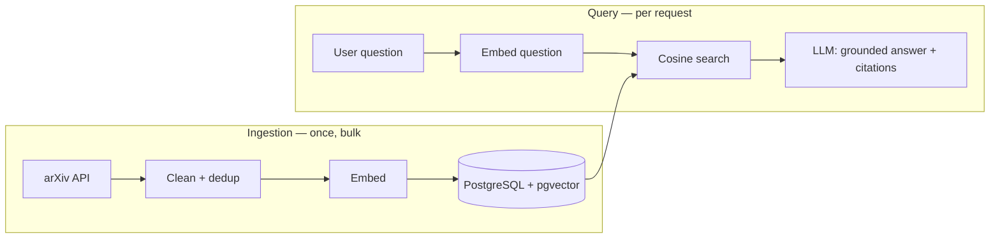

# PaperMind

**Ask a question about AI research, get an answer grounded in real papers — with the sources it came from.**

A retrieval-augmented generation service over a corpus of ArXiv CS/AI abstracts. Semantic search finds the relevant passages, an LLM answers from those passages only, and every answer carries its citations. When the corpus does not support an answer, it says so instead of guessing.

Runs entirely on your machine with `docker compose up` — using either a local model via Ollama (no API key, no cost) or your own provider key.

> **Status: in development — 9 of 13 steps complete.**
> A working browser app over the corpus: ask a question, get a grounded cited answer or an
> honest refusal, and see the papers behind both. Containerisation and deployment are not
> built yet.
> No benchmark in this README is estimated or aspirational — numbers appear only after
> they are measured.

---

## Quickstart

Requires Docker and [uv](https://docs.astral.sh/uv/).

```bash
git clone https://github.com/bunyamin-polat/papermind.git
cd papermind
cp .env.example .env

uv sync
docker compose up -d
uv run python -m scripts.check_db
```

Expected output:

```text
connecting to localhost:5434/papermind
  postgres : PostgreSQL 17.10 (Debian 17.10-1.pgdg12+1) on aarch64-unknown-linux-gnu
  pgvector : 0.8.6
  cosine distance between [1,0] and [0,1] : 1.0

step 0 OK
```

If port 5434 is taken on your machine, change `POSTGRES_PORT` in `.env` — only the host side of the mapping moves.

Then load the corpus:

```bash
uv run python -m ingestion.fetch --limit 30000   # query arXiv, sample → data/raw/
uv run python -m ingestion.clean                 # normalise, deduplicate, load into papers
uv run python -m ingestion.embed                 # embed every abstract into pgvector
```

The fetch queries the arXiv API, which permits one request every three seconds, so a 30,000-paper corpus takes roughly twenty minutes. Each year is checkpointed to `data/raw/years/` as it completes, so an interrupted run resumes instead of restarting. Pass `--refresh` to ignore the checkpoints and pull newer papers.

All three are safe to re-run. `id` is the primary key and the load upserts, so a second `clean` leaves the row count unchanged; `embed` skips papers that already have a vector for the configured model, so an interrupted run resumes where it stopped.

To reset the database completely (drops the volume and re-runs `db/init/`):

```bash
docker compose down -v && docker compose up -d
```

## How it works

Two things happen at completely different times, and keeping them separate is the core of the design.

**Ingestion** runs once, in bulk: papers are fetched, cleaned, embedded, and written to Postgres — one vector per paper. **Query** runs per request: the question is embedded, the nearest papers are retrieved by cosine similarity, and an LLM is asked to answer from those abstracts and nothing else.



A user never uploads anything. The corpus is fixed, loaded once, and shared by every query.

## Configuration

All configuration is environment variables, read in exactly one place ([`core/config.py`](core/config.py)). Copy `.env.example` to `.env` and edit.

### Choosing a model

Two supported paths, behind one provider abstraction — switching is a config change, not a code change.

| Path | Cost | Setup | Use when |
|---|---|---|---|
| **Local (Ollama)** | Free | Install Ollama, pull a model | Default. Development, and anyone who wants to run this without paying for anything |
| **Your own API key** | Yours | Put the key in `.env` | You want frontier-model answer quality |

*The generation path is not implemented yet — it arrives at step 5. The rows above describe the intended design, not shipped behaviour.*

**Embeddings are always local** and already working: `BAAI/bge-base-en-v1.5`, 768 dimensions, run through `sentence-transformers`. The retrieval half of the system therefore costs nothing regardless of which generation path you configure.

The model was chosen by measurement, not default. `all-MiniLM-L6-v2` — the obvious small choice — has a 256-token window, and 26% of these abstracts exceed it (median 206 tokens, p99 394, max 541). Those would have been silently truncated, losing ~15% of their text with no error raised. A 512-token window fits 3,999 of 4,000 abstracts whole.

**There is no chunking**, and that is a consequence of the same measurement: an abstract that fits the window whole should not be cut into pieces that each lose the other's context. Chunking becomes necessary when documents outgrow the window, which is a different corpus than this one.

## Corpus

arXiv abstracts in eight AI categories — `cs.AI`, `cs.CL`, `cs.CV`, `cs.IR`, `cs.LG`, `cs.MA`, `cs.NE`, `stat.ML` — sampled from 2015 onward, queried live from the [arXiv API](https://info.arxiv.org/help/api/user-manual.html).

**Why the API and not a dataset dump.** The obvious choice, HuggingFace's `gfissore/arxiv-abstracts-2021`, is a snapshot that ends in December 2021. A corpus frozen there cannot answer anything about work published since — most of what anyone would ask an AI-research assistant. Querying arXiv directly means the corpus reaches the present day and can be refreshed by re-running the fetch.

**Why these eight categories and not more.** They are arXiv's core AI set plus `cs.MA`. Broader categories such as `cs.RO` and `cs.CR` already reach the corpus through cross-listing — an ML-heavy robotics paper carries `cs.LG` as well — so adding them explicitly would only pull in the papers carrying *no* AI tag, which are by definition the least relevant. `cs.MA` is the exception: multi-agent work is under-represented by cross-listing and directly on topic.

**Sampling took three attempts.**

The arXiv API sorts only by submission date and truncates, so asking for "the newest N" of any window returns that window's tail:

| Scheme | What it actually produced |
|---|---|
| Newest N per year | Each year collapsed onto its final three weeks — "2018" meant 10-31 December |
| Newest N per month | Each month collapsed onto its final day; 98% of papers fell on days 22-31 |
| **Randomly-offset slice per month** | Current scheme — contiguous, but no longer always at the same end |

Narrowing the window was not the fix, because truncation simply moved down a level. The fix is to place the slice at a random offset inside each month, chosen from a fixed seed so the corpus stays reproducible.

| Year | 2015 | 2016 | 2017 | 2018 | 2019 | 2020 | 2021 | 2022 | 2023 | 2024 | 2025 | 2026 |
|---|--:|--:|--:|--:|--:|--:|--:|--:|--:|--:|--:|--:|
| Papers | 563 | 732 | 960 | 1,332 | 1,799 | 2,328 | 2,531 | 2,772 | 3,408 | 4,332 | 5,280 | 4,024 |

Papers carry an average of two categories, so the per-category counts overlap: `cs.LG` 13,945 ·
`cs.CV` 9,875 · `cs.AI` 9,176 · `cs.CL` 5,826 · `stat.ML` 3,902 · `cs.IR` 1,264 · `cs.NE` 804 ·
`cs.MA` 618. 2026 covers January to August, the year being incomplete.

**Known limit:** the sample is a small fraction of what arXiv holds — 30,061 of roughly 590,000 AI
papers published since 2015. Any *specific* paper is therefore unlikely to be present. That is what
makes refusal a first-class outcome rather than an edge case, and why it gets its own build step and
its own test.

The corpus is **not committed to this repository**; it is fetched at setup time. ArXiv content remains under its authors' terms — see [arxiv.org/help/license](https://arxiv.org/help/license).

## Project structure

```text
papermind/
├── core/          # config and the LLM provider wrapper
├── ingestion/     # fetch → clean → embed (runs once, in bulk)
├── retrieval/     # question → embedding → top-k papers → grounding prompt
├── evaluation/    # hand-written questions, hit-rate@k, latency, cost
├── storage/       # Postgres + pgvector schema and access
├── app/           # FastAPI: POST /ask
├── ui/            # Streamlit front end
├── scripts/       # operational checks
├── db/init/       # SQL that runs on first database creation
└── infra/         # Terraform
```

`ingestion/` and `retrieval/` are separate packages because they run at different times and rates. Keeping them apart is what stops the bulk-load path and the per-request path from bleeding into each other.

## Project status

Thirteen steps. Each one ends with something that runs, and this table is updated when it does.

✅ done · 🟡 in progress · ⬜ not started

| # | Step | State |
|---|---|:-:|
| 0 | Setup — Docker, Postgres + pgvector, config, health check | ✅ |
| 1 | Ingest the corpus into a `papers` table | ✅ |
| 2 | Embed into pgvector | ✅ |
| 3 | Retrieval — question → top-k papers by cosine similarity | ✅ |
| 4 | Evaluation harness — hand-written questions, hit-rate@k | ✅ |
| 5 | RAG generation — grounded answer with citations | ✅ |
| 6 | Refusal — tested "I don't know" path | ✅ |
| 7 | FastAPI `/ask` endpoint | ✅ |
| 8 | Streamlit UI | ✅ |
| 9 | Dockerise the application | ⬜ |
| 10 | Deploy to AWS | ⬜ |
| 11 | CI/CD | ⬜ |
| 12 | Measure and publish | ⬜ |

**Works today:** PostgreSQL 17.10 with pgvector 0.8.6 comes up via Docker Compose. The ingestion
pipeline queries the arXiv API, samples across 2015-2026, cleans and deduplicates, and loads
**30,061 papers**; embedding stores one 768-dimension vector per paper behind an HNSW index. All
three commands are idempotent. Semantic search returns sensible neighbours in **3.7 ms** at full
recall, and out-of-domain questions land measurably further away — cosine distance 0.18 for
"attention mechanism in transformers" against 0.45 for "how do you bake sourdough bread".

## Retrieval

`retrieval/search(question, k)` embeds the question with the same model as the corpus and returns the
k nearest papers, closest first. A hit is a whole paper — nothing was chunked, so nothing has to be
stitched back together, and every result already is the unit a reader would open.

```console
$ uv run python -m scripts.ask "what is an attention mechanism in neural networks"

1. [0.160] Understanding Attention: In Minds and Machines
   https://arxiv.org/abs/2012.02659
2. [0.175] Understanding More about Human and Machine Attention in Deep Neural Networks
   https://arxiv.org/abs/1906.08764
3. [0.203] Thank you for Attention: A survey on Attention-based Artificial Neural Networks...
   https://arxiv.org/abs/2102.07259
4. [0.208] Are Sixteen Heads Really Better than One?
   https://arxiv.org/abs/1905.10650
```

### Where semantic search loses to keyword search

Two failures, both reproduced against this corpus rather than quoted from a blog post:

**Exact identifiers.** Asked for `2406.06538` — a paper that *is* in the corpus — semantic search does
not return it in the top 20. It answers with unrelated optimisation papers at distance 0.52, because
an identifier carries no meaning to embed. A keyword index finds it in one lookup.

**Negation.** Asked for "papers that do NOT use transformers", the second result is *Simplifying
Transformer Blocks*. Embeddings have no representation for negation: "not X" lands next to "X".

Both are the standard argument for hybrid retrieval, which is why BM25 fusion sits at the top of the
roadmap rather than in v1. Neither is hypothetical here — they are what this corpus actually does.

### Two safeguards

**The corpus and the query must share an embedding model.** Using different ones returns neighbours
that mean nothing, with no error anywhere, so the retriever checks which model produced the stored
vectors and raises `ModelMismatch` if it disagrees with the configuration.

**`hnsw.ef_search` is set per connection, never left to the default** — see below for why that matters
more than it should.

## Running it

Three processes: Postgres in Docker, Ollama for generation, and the app.

```bash
docker compose up -d                       # Postgres + pgvector
ollama serve &                             # local model
uv run uvicorn app.main:app &              # API on :8000
uv run streamlit run ui/Home.py            # UI on :8501
```

The UI reaches the API over HTTP and never imports from it — `tests/test_ui.py` asserts that by
parsing the imports. It is an easy boundary to erase by accident, and erasing it would make the API
decorative: untested by anything a user touches, and at step 9 a container with two entrypoints
pretending to be one.

**What the UI shows that most AI demos do not.** Every answer carries the papers consulted, how close
each one was, which models produced it, and how long it took. A refusal is rendered as information
rather than as an error, with the five consulted papers still listed — because "consulted five, none
answered" is a different statement from "something broke", and only one of them is true. All of it is
free to display, because the API already returns it.

## API

```bash
uv run uvicorn app.main:app --reload    # http://localhost:8000/docs
```

```console
$ curl -s localhost:8000/health
{"status":"ok","papers":30061,"embeddings":30061,
 "embedding_model":"BAAI/bge-base-en-v1.5","generation_model":"qwen3:4b-instruct",
 "llm_reachable":true}
```

```console
$ curl -s -X POST localhost:8000/ask -H 'Content-Type: application/json' \
    -d '{"question":"how can learned noise protect private data sent to a cloud service?"}'
{
  "answer": "Learned noise can protect private data by adding distributions that reduce the
             information content of the communicated data [1]. ...",
  "refused": false,
  "sources":   [{"marker":1,"paper_id":"1905.11814","title":"Shredder: Learning Noise ...",
                 "url":"https://arxiv.org/abs/1905.11814","distance":0.1856}],
  "retrieved": [ ...5 papers with distances... ],
  "models":    {"embedding":"BAAI/bge-base-en-v1.5","generation":"qwen3:4b-instruct"},
  "latency_ms": 3782.3
}
```

**`retrieved` is returned next to `sources`.** `sources` is what the answer cited; `retrieved` is
everything that went into the prompt. A refusal therefore returns five papers and zero sources —
"consulted five, none answered" is a different statement from "found nothing", and only one of them
is true. It is also the difference between diagnosing bad retrieval and bad grounding.

**The response names the models that produced it.** Which embedder and which generator answered is
part of what the answer means; two responses are not comparable without it.

**Failure modes are distinguished.** Ollama unreachable is `503` — a dependency is down, retrying may
work. A corpus embedded with a different model is `500` — this service is misconfigured and retrying
never helps. Both carry a message that names what to fix.

**The embedding model loads at startup, not on first request.** It costs about eight seconds; left
lazy, the first caller sees eleven seconds where everyone else sees three, which reads as an
intermittent fault rather than a warm-up.

## Generation

```console
$ uv run python -m retrieval.answer "how can learned noise protect private data sent to a cloud inference service"

Learned noise can protect private data sent to a cloud inference service by adding noise
distributions that reduce the information content of the communicated data [1]. Shredder, an
end-to-end framework, learns these distributions through an offline process that balances
inference accuracy against information degradation [1]. Experiments show a 74.70% reduction in
mutual information between the input and the communicated data [1].

Sources:
  [1] Shredder: Learning Noise Distributions to Protect Inference Privacy
      https://arxiv.org/abs/1905.11814
```

### The model is never shown an identifier

It cites sources by their **position** in the list it was given — `[1]`, `[2]` — and code maps
those positions back to papers. Ask a model to write `arXiv:2406.06538` and sooner or later it
writes a plausible identifier for a paper that does not exist, with nothing in the text to reveal
it. A position cannot be inflated into something real: `[9]` in a list of five is detectably wrong,
so it is dropped and counted rather than shown.

Across 68 generated answers, **zero invented citations**.

### Refusal is one exact sentence

`The provided sources do not answer this question.` — not "say you don't know". An exact string is
testable; an instruction to be honest is not.

### What it costs, per local model

Same prompt, same corpus, 24 answerable and 6 unanswerable questions:

| | `qwen3:4b-instruct` | `gpt-oss:20b` |
|---|--:|--:|
| Cites the expected paper | 83% | **92%** |
| False refusals (answerable, refused) | 3 / 24 | 1 / 24 |
| Out-of-corpus refused | **100%** | **100%** |
| Invented citations | 0 | 0 |
| Latency (median / max) | **3.2s / 12.3s** | 5.5s / 37.3s |
| Download | **2.5 GB** | 13.8 GB |

The larger model closes the gap to the retrieval ceiling — 92% end to end against 92% hit-rate,
meaning generation loses nothing — **and it does so without spending any refusal discipline.** Both
refuse every out-of-corpus question.

The 4B is the default anyway, because 2.5 GB is the difference between "clone and run" and "clone,
then find 14 GB and enough VRAM". Set `OLLAMA_MODEL=gpt-oss:20b` to trade 2.3 seconds for nine
points of coverage.

### The number most RAG projects do not publish

Retrieval hit-rate@5 is 92%. End-to-end citation accuracy with the small model is 83%. **The
nine-point gap is generation discarding papers retrieval had already found.** Two of the three false
refusals had the correct paper at rank 1, with the answer stated verbatim in the abstract — the
model simply declined. Reporting only the retrieval number would have hidden that entirely.

## Vector index

Which index, measured rather than assumed — 30,061 vectors, top-5, timings taken server-side from
`EXPLAIN ANALYZE`, recall measured against exact search ([`scripts/bench_index.py`](scripts/bench_index.py)):

| Configuration | Median | p95 | recall@5 | Index used |
|---|--:|--:|--:|:-:|
| No index (exact) | 70.5 ms | 81.1 ms | 100% | — |
| HNSW `ef_search=40` | 69.7 ms | 72.2 ms | 100% | **0/12** |
| **HNSW `ef_search=64`** | **3.7 ms** | 4.9 ms | 100% | 12/12 |
| HNSW `ef_search=100` | 4.6 ms | 7.3 ms | 100% | 12/12 |
| IVFFlat `probes=10` | 1.2 ms | 1.4 ms | 93.3% | 12/12 |
| IVFFlat `probes=20` | 2.2 ms | 2.4 ms | 98.3% | 12/12 |
| IVFFlat `probes=40` | 4.2 ms | 4.8 ms | 100% | 12/12 |

**HNSW.** At full recall it is marginally faster than IVFFlat (3.7 ms against 4.2 ms), but the margin
alone would not decide it. IVFFlat clusters around whatever data exists when the index is built and
degrades as rows are added; this corpus is meant to be refreshed, so an index that tolerates
incremental inserts is worth 5× the build time (16.9 s against 3.3 s).

**One trap worth knowing.** At `hnsw.ef_search = 40` the planner abandons the index in every query
and falls back to a sequential scan — 19× slower, identical results, no error and no warning. **40 is
pgvector's own default**, so leaving the setting untouched picks the one value that fails.

The cause is a discontinuity in pgvector 0.8.6's cost estimate. Below 40 the estimated startup cost
climbs steeply — 348 at `ef=5`, 494 at 10, 754 at 20, 992 at 30 — and by 40 it has passed the
sequential-scan estimate of 1217, so the planner rejects the index. At `ef=50` it resets to 347 and
from there rises almost flat, reaching only 370 by `ef=400`. Two branches of the formula, meeting
badly, exactly at the default:

| `ef_search` | 5 | 10 | 20 | 30 | **40** | 50 | 64 | 100 | 200 |
|---|--:|--:|--:|--:|--:|--:|--:|--:|--:|
| Median | 1.0 ms | 1.2 ms | 1.9 ms | 2.3 ms | **71.5 ms** | 3.4 ms | 3.7 ms | 4.7 ms | 7.3 ms |
| Plan | index | index | index | index | **seq scan** | index | index | index | index |

Recall@5 was 100% at every value on this corpus, so the configured 100 buys margin rather than
accuracy. It is pinned in `core/config.py` rather than left to the default.

## Metrics

Measured by [`evaluation/run.py`](evaluation/run.py) against 34 hand-written questions: 24 answerable
from the corpus, 6 the corpus provably cannot answer, and 4 that target known weak spots. Questions
were written by reading a random sample of papers, and the retrieval results were not consulted while
writing them.

| k | hit-rate | MRR |
|--:|--:|--:|
| 1 | 88% | 0.875 |
| 3 | 92% | 0.889 |
| **5** | **92%** | **0.889** |
| 10 | 100% | 0.903 |

| Metric | Value |
|---|---|
| Corpus size | 30,061 papers |
| Retrieval hit-rate@5 | 92% (24 questions) |
| Query latency | 39 ms median, 42 ms p95 |
| Cost per query | $0 — retrieval is entirely local |
| Refusal rate on out-of-corpus questions | 100% (6 questions) |
| End-to-end citation accuracy | 83% small model · 92% large |
| Answer latency | 3.2 s median (local, free) |
| Invented citations | 0 / 68 answers |

**The two misses are not the same kind of miss**, which is only visible because the harness prints
per-question results:

- *"how are graph convolutional networks used to forecast traffic across a road network?"* returned
  five papers that are all genuinely about graph convolutions for traffic forecasting; the expected
  paper was sixth. This is a limitation of single-gold-label evaluation, not of retrieval.
- *"which application areas do recommender system researchers neglect?"* returned five recommender-
  systems papers, none of which address neglected domains. Here retrieval matched the topic and
  missed the actual question.

**Out-of-corpus questions separate cleanly.** The closest paper for an in-corpus question sits at
cosine distance 0.112-0.290; for a question the corpus cannot answer, 0.411-0.506. The gap of 0.121
with no overlap is what makes a distance-based refusal threshold viable at step 6 — measured rather
than assumed.

